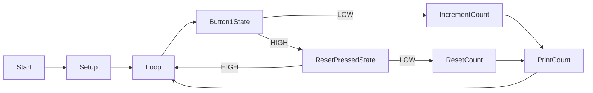
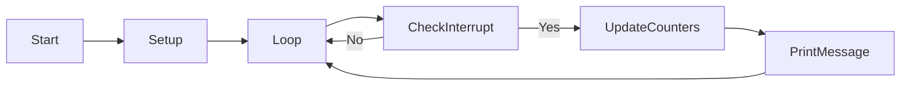

# Informe de Práctica sobre Interrupciones en Arduino


## Objetivo
El objetivo de esta práctica es familiarizarse con el uso de interrupciones en Arduino mediante la implementación de un programa que utiliza dos botones como fuente de interrupción. Uno de los botones se utilizará para incrementar un contador y el otro para restablecer el contador a cero.

# Practica A: Interrupción por GPIO

## Descripción del Programa
El programa consiste en un sketch de Arduino que cuenta con dos botones y un LED. El botón 1 se utiliza para incrementar un contador cada vez que se pulsa, mientras que el botón 2 se utiliza como fuente de interrupción para restablecer el contador a cero. Además, se ha incluido una función de "debouncing" para evitar problemas causados por el rebote mecánico de los botones y obtener lecturas falsas del botón.

## Código Utilizado

### `main.cpp`
```cpp
#include <Arduino.h>

#define DELAY  500;

const uint8_t BUTTON1_PIN = 8;
const uint8_t BUTTON2_PIN = 18;
const uint8_t LED_PIN = 15;


uint32_t count = 0;

struct Button{
  const uint8_t PIN;
  uint32_t numberKeyPresses;
  uint8_t bounceTime; // Tiempo en ms para el debouncing
  bool buttonState;
  bool pressed;
};

Button button1 = {BUTTON1_PIN, 0, 50, false, false};
Button button2 = {BUTTON2_PIN, 0, 50, false, false};

void IRAM_ATTR isr() {
  Serial.println("Interrupted by button 2, set count to 0");
  count = 0;
}

void setup(){
  Serial.begin(9600);
  pinMode(button1.PIN, INPUT_PULLUP);
  pinMode(button2.PIN, INPUT_PULLUP);
  pinMode(LED_PIN, OUTPUT);
  attachInterrupt(button2.PIN, isr, FALLING);
  Serial.println("Programa inicicado");
}

void loop(){

  button1.buttonState=digitalRead(button1.PIN);

  if (button1.buttonState == LOW && !button1.pressed) {
    count++;
    button1.pressed = true;
    Serial.print("Contador: ");
    Serial.println(count);
    digitalWrite(LED_PIN, HIGH); // Encendemos el LED
    delay(button1.bounceTime); // Debouncing

  }
  if (button1.buttonState == HIGH && button1.pressed) {
    digitalWrite(LED_PIN, LOW);
    button1.pressed = false;
    delay(button1.bounceTime); // Debouncing
  }
}
```
## Funcionamiento del programa

El programa comienza inicializando los pines de los botones y del LED. Luego, configura una interrupción en el botón 2 para que cuando se detecte una caída de flanco, se llame a la función `isr()` que restablece el contador a cero.

En el bucle principal (`loop()`), se verifica el estado del botón 1. Si se detecta una pulsación y el botón no estaba previamente pulsado, se incrementa el contador y se imprime en serie. Se utiliza una técnica de "debouncing" para evitar contar múltiples veces una sola pulsación debido al rebote mecánico del botón.

## Salida a través de la impresión Serie

```cpp
Programa iniciado
Contador: 1
Contador: 2
Interrupted by button 2, set count to 0
Contador: 1
Contador: 2
```

En este ejemplo, el programa se inicia, se presiona dos veces el botón 1 (incrementando el contador), luego se presiona el botón 2 (causando una interrupción y restableciendo el contador a cero), y finalmente se presiona dos veces más el botón 1.


## Diagrama de Flujo



# Practica B: Interrupción por timer

## Descripción del Programa
En esta práctica, se utiliza un timer en Arduino para generar interrupciones periódicas. El programa cuenta las interrupciones generadas por el timer y las muestra a través de la impresión en serie.

## Código Utilizado

### `main2.cpp`
```cpp
#include <Arduino.h>

volatile int interruptCounter;
int totalInterruptCounter;

hw_timer_t * timer = NULL;
portMUX_TYPE timerMux = portMUX_INITIALIZER_UNLOCKED;

void IRAM_ATTR onTimer() {
    portENTER_CRITICAL_ISR(&timerMux);
    interruptCounter++;
    portEXIT_CRITICAL_ISR(&timerMux);
}

void setup() {
    Serial.begin(115200);
    timer = timerBegin(0, 80, true);
    timerAttachInterrupt(timer, &onTimer, true);
    timerAlarmWrite(timer, 1000000, true);
    timerAlarmEnable(timer);
}

void loop() {
    if (interruptCounter > 0) {
        portENTER_CRITICAL(&timerMux);
        interruptCounter--;
        portEXIT_CRITICAL(&timerMux);
        totalInterruptCounter++;
        Serial.print("An interrupt as occurred. Total number: ");
        Serial.println(totalInterruptCounter);
    }
}

```
## Funcionamiento del programa

El programa utiliza un timer en Arduino para generar interrupciones periódicas. En cada interrupción, se incrementa un contador de interrupción. Luego, en el bucle principal (`loop()`), se verifica si ha ocurrido alguna interrupción. Si es así, se decrementa el contador de interrupción y se incrementa un contador total. Se imprime en serie un mensaje indicando que se ha producido una interrupción y se muestra el número total de interrupciones.

## Salida a través de la Impresión en Serie

``` cpp
An interrupt as occurred. Total number: 1
An interrupt as occurred. Total number: 2
An interrupt as occurred. Total number: 3
```
Esto indica que se han producido tres interrupciones en total durante la ejecución del programa.

## Diagrama de Flujo


